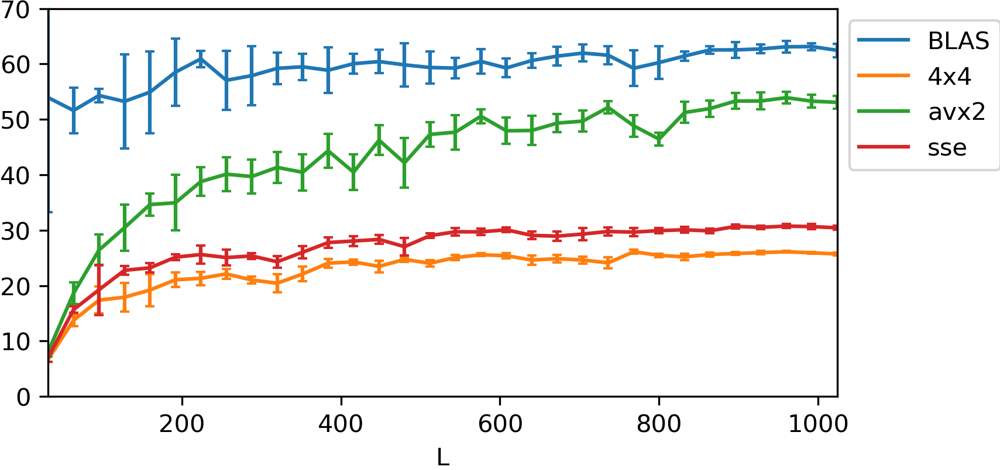

# OptimizeDGEMM

General matrix multiplication (GEMM) serves as a bottleneck of most of the matrix computation algorithms.
Modern CPU and GPU architectures can achieve near-optimal GEMM performance through specialized implementations. Leading BLAS libraries such as Intel MKL, OpenBLAS, and BLIS regularly attain over 90% of theoretical peak performance on x86 processors. For GPU acceleration, NVIDIA's cuBLAS library delivers similarly efficient matrix computations.

This repository contains the code for an optimization of the DGEMM (Double Precision General Matrix Multiplication). The matrices are generated and managed by `Eigen` library, and stored in the column-major order.
The matrix elements $C_{i,j}$ is stored in the memory as `C[i + j * LDC]`, in this case, `LDC = C.cols()`.

This project is based on this [project](https://github.com/yzhaiustc/Optimizing-DGEMM-on-Intel-CPUs-with-AVX512F) and the awesome [lecture notes](https://www.mathematik.uni-ulm.de/~lehn/sghpc/gemm/index.html).

### Pure C version

In this part, some basic optimization techniques are used to optimize the DGEMM:

- Loop reordering: The loops are reordered to have the stride-1 access in the innermost loop. This improves spatial locality and allows better vectorization.

- Loop unrolling: The innermost loop is unrolled to perform multiple operations per iteration. This reduces loop overhead and allows better instruction-level parallelism.

- Blocking: The matrices are divided into smaller submatrices or blocks. Specifically, the algorithm is divided tow `micro_kernel`s, which are the smallest units of computation; and a `macro_kernel` that schedules the `micro_kernel`s.

These optimizations, combined with compiler flags for auto-vectorization and aggressive optimization, can significantly improve the performance of DGEMM compared to a naive triple-loop implementation. 

There are few versions of the pure C version:
- `naive`: the naive triple-loop implementation, with `M-N-K` order.
- `naive-knm`: the naive triple-loop implementation, with `K-N-M` order.
- `naive-nkm`: the naive triple-loop implementation, with `N-K-M` order.

Out of these, `naive-nkm` is the most efficient one.


## Usage

```bash
./run.sh
```

## Results


